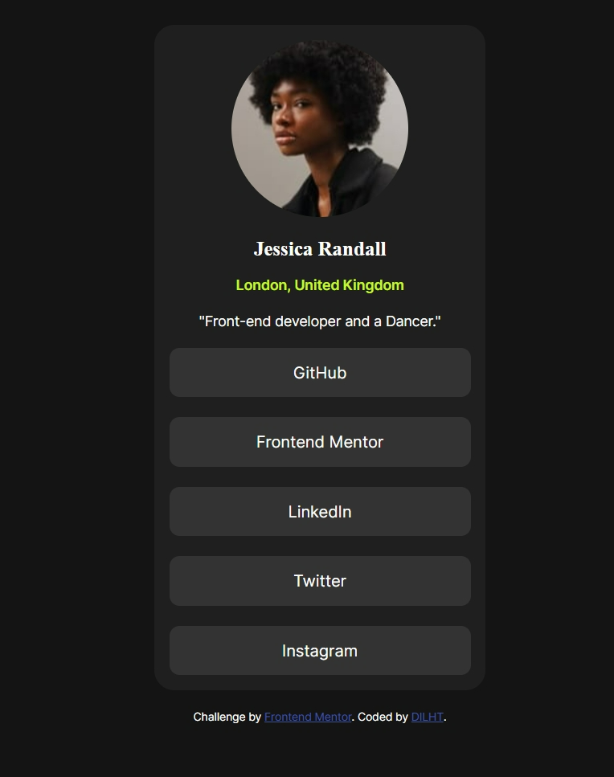

# Frontend Mentor - Social links profile solution

This is a solution to the [Social links profile challenge on Frontend Mentor](https://www.frontendmentor.io/challenges/social-links-profile-UG32l9m6dQ). Frontend Mentor challenges help you improve your coding skills by building realistic projects. 

## Table of contents

- [Overview](#overview)
  - [The challenge](#the-challenge)
  - [Screenshot](#screenshot)
  - [Links](#links)
- [My process](#my-process)
  - [Built with](#built-with)
  - [What I learned](#what-i-learned)
  - [Continued development](#continued-development)
   

 

## Overview

### The challenge

Users should be able to:

- See hover and focus states for all interactive elements on the page

### Screenshot

### Links

- Solution URL: [Add solution URL here](https://your-solution-url.com)
- Live Site URL: (https://dilht-social-links.vercel.app)

## My process
first i worked on the aligning the tags in the html5 sematic and then afterwards i style the page using a different file a css file where i styled the links and add hovering to them 

### Built with

- Semantic HTML5 markup
- CSS custom properties
- Flexbox

### What I learned

I have learned how to flex-direction and gaps and media query

### Continued development
 i want to continue working on responsiveness 

 
## Author

- Website - [Daniel](https://dilht-social-links.vercel.app)
- Frontend Mentor - [@DILHT](https://www.frontendmentor.io/profile/DILHT)
 
